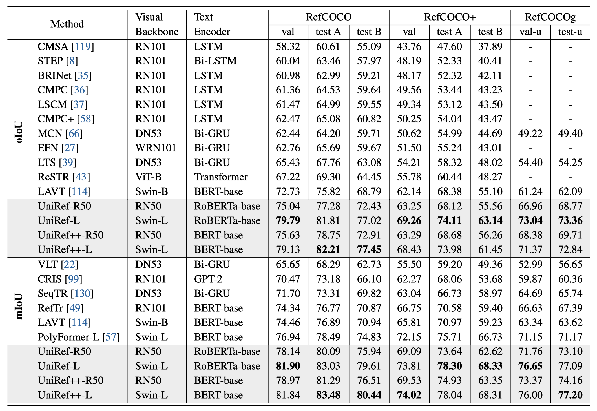
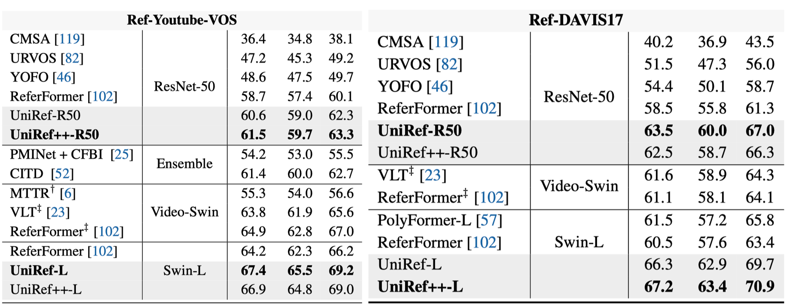
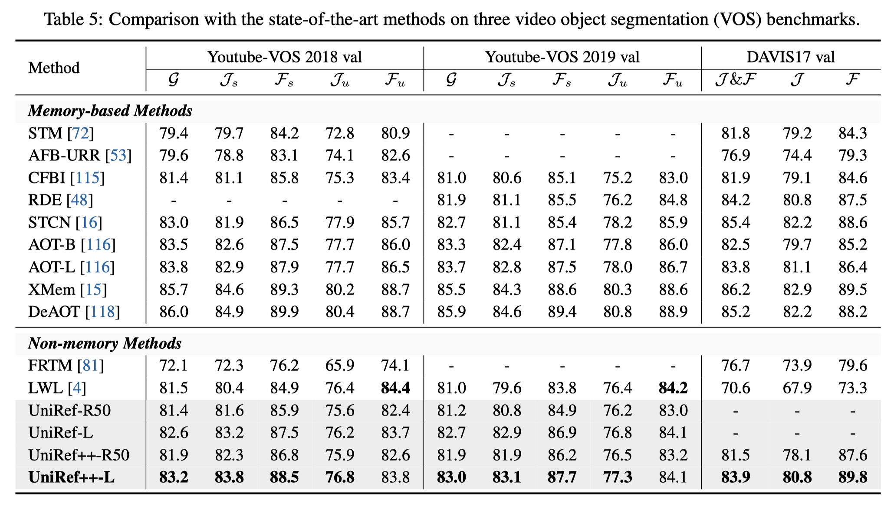
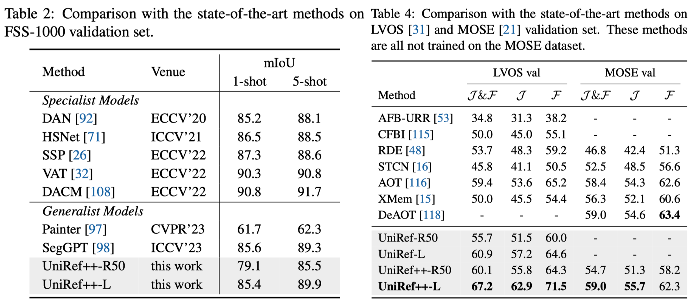

# UniRef++: Segment Every Reference Object in Spatial and Temporal Spaces

Official implementation of [UniRef++](), an extended version of ICCV2023 [UniRef](https://openaccess.thecvf.com/content/ICCV2023/papers/Wu_Segment_Every_Reference_Object_in_Spatial_and_Temporal_Spaces_ICCV_2023_paper.pdf).


## Highlights

- UniRef/UniRef++ is a unified model for four object segmentation tasks, namely referring image segmentation (RIS), few-shot segmentation (FSS), referring video object segmentation (RVOS) and video object segmentation (VOS).
- At the core of UniRef++ is the UniFusion module for injecting various reference information into network. And we implement it using flash attention with high efficiency.
- UniFusion could play as the plug-in component for foundation models like [SAM](https://github.com/facebookresearch/segment-anything).


## Schedule

- [ ] Add Training Guide
- [ ] Add Evaluation Guide
- [x] Release Model Checkpoints
- [x] Release Code

## Results


https://github.com/FoundationVision/UniRef/assets/21001460/63d875ed-9f5b-47c9-998f-e83faffedbba


### Referring Image Segmentation


### Referring Video Object Segmentation


### Video Object Segmentation


### Zero-shot Video Segmentation & Few-shot Image Segmentation


## Model Zoo

- The results are reported on the validation set.

  | Model             | RefCOCO | FSS-1000 | Ref-Youtube-VOS | Ref-DAVIS17 | Youtube-VOS18 | DAVIS17 | LVOS | Checkpoint |
  | ------------------| :----:  | :---: | :-----: | :---: | :--: | :--: | :-------: | :--: |
  | UniRef++-R50      |  75.6   | 79.1  |  61.5   | 63.5  | 81.9 | 81.5 |   60.1    | [model](https://connecthkuhk-my.sharepoint.com/:u:/g/personal/wjn922_connect_hku_hk/Ecw4SgowlptPmDg14p0j6X0BKkqF0unHaSLat4TVstJdoQ?e=8z7DW8) |
  | UniRef++-Swin-L   |  79.1   | 85.4  |  66.9   | 67.2  | 83.2 | 83.9 |   67.2    | [model](https://connecthkuhk-my.sharepoint.com/:u:/g/personal/wjn922_connect_hku_hk/EST3QVvBmWVLrdwQ1D_nDwIBBvZ5U9I14MIkj-LirFTA_w?e=uxeOdn)


## Installation

See [INSTALL.md](./INSTALL.md)

## Getting Started


## Citation

If you find this project useful in your research, please consider cite:

```BibTeX
@article{wu2023uniref++,
  title={UniRef++: Segment Every Reference Object in Spatial and Temporal Spaces},
  author={Wu, Jiannan and Jiang, Yi and Yan, Bin and Lu, Huchuan and Yuan, Zehuan and Luo, Ping},
  journal={arXiv preprint arXiv:2312.15715},
  year={2023}
}
```

```BibTeX
@inproceedings{wu2023uniref,
  title={Segment Every Reference Object in Spatial and Temporal Spaces},
  author={Wu, Jiannan and Jiang, Yi and Yan, Bin and Lu, Huchuan and Yuan, Zehuan and Luo, Ping},
  booktitle={Proceedings of the IEEE/CVF International Conference on Computer Vision},
  pages={2538--2550},
  year={2023}
}
```

## Acknowledgement

The project is based on [UNINEXT](https://github.com/MasterBin-IIAU/UNINEXT) codebase. We also refer to the repositories [Detectron2](https://github.com/facebookresearch/detectron2), [Deformable DETR](https://github.com/fundamentalvision/Deformable-DETR), [STCN](https://github.com/hkchengrex/STCN), [SAM](https://github.com/facebookresearch/segment-anything). Thanks for their awsome works!


