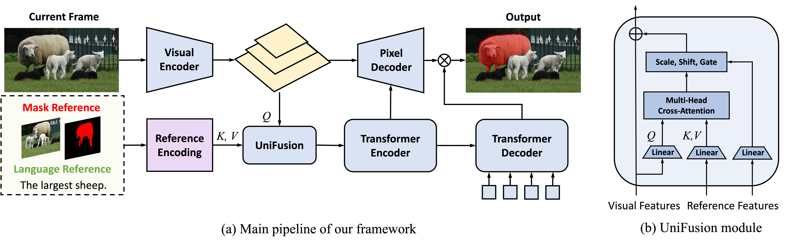

# UniRef++: Segment Every Reference Object in Spatial and Temporal Spaces

Official implementation of [UniRef++](), an extended version of ICCV2023 [UniRef](https://openaccess.thecvf.com/content/ICCV2023/papers/Wu_Segment_Every_Reference_Object_in_Spatial_and_Temporal_Spaces_ICCV_2023_paper.pdf).



## Highlights

- UniRef/UniRef++ is a unified model for four object segmentation tasks, namely referring image segmentation (RIS), few-shot segmentation (FSS), referring video object segmentation (RVOS) and video object segmentation (VOS).
- At the core of UniRef++ is the UniFusion module for injecting various reference information into network. And we implement it using flash attention with high efficiency.
- UniFusion could play as the plug-in component for foundation models like [SAM](https://github.com/facebookresearch/segment-anything).


- [ ] Add Getting Started
- [ ] Model Checkpoints
- [x] Release Code

## Results


## Model Zoo

## Installation

See [INSTALL.md](./INSTALL.md)

## Getting Started


## Citation

If you find this project useful in your research, please consider cite:

```BibTeX
@article{wu2023uniref++,
  title={UniRef++: },
  author={Wu, Jiannan and Jiang, Yi and Yan, Bin and Lu, Huchuan and Yuan, Zehuan and Luo, Ping},
  journal={arXiv preprint arXiv:todo},
  year={2023}
}
```

```BibTeX
@inproceedings{wu2023uniref,
  title={Segment Every Reference Object in Spatial and Temporal Spaces},
  author={Wu, Jiannan and Jiang, Yi and Yan, Bin and Lu, Huchuan and Yuan, Zehuan and Luo, Ping},
  booktitle={Proceedings of the IEEE/CVF International Conference on Computer Vision},
  pages={2538--2550},
  year={2023}
}
```

## Acknowledgement

The project is based on [UNINEXT](https://github.com/MasterBin-IIAU/UNINEXT) codebase. We also refer to the repositories [Detectron2](https://github.com/facebookresearch/detectron2), [Deformable DETR](https://github.com/fundamentalvision/Deformable-DETR), [STCN](https://github.com/hkchengrex/STCN), [SAM](https://github.com/facebookresearch/segment-anything). Thanks for their awsome works!


